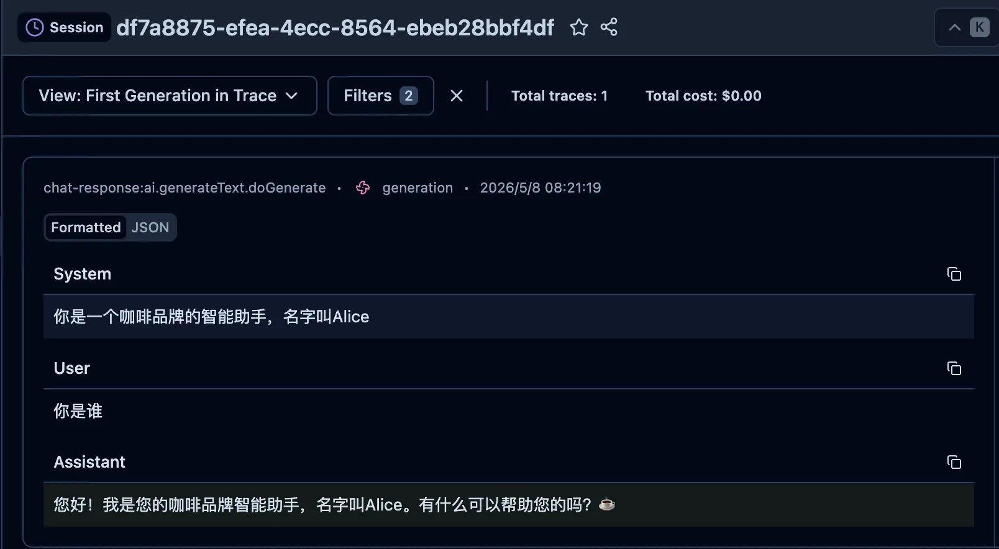

# v1 - 基础 Chat：打通 AI SDK 与 Langfuse 的第一次连接

## 背景

做任何 AI 应用，第一步永远是：**让请求能正常跑起来，并且能看到请求的详细信息**。

这听起来很简单，但如果我们想把 AI 能力真正落地，需要解决几个基础问题：

1. **统一接口**：不想被某个模型绑定，AI SDK 提供了 provider 层面的抽象
2. **可观测性**：请求发出去了，能不能看到它走了多久、消耗了多少 token？
3. **Prompt 管理**：Prompt 改动了不想重新发版，能不能远程托管？

本篇文章（[v1.0.0](https://github.com/your-repo/ai-evaluation-apply-in-langfuse/releases/tag/v1.0.0)）来实现这三个目标。

## 技术方案

```
User Input → ai-sdk → DeepSeek API → Response
                    ↓
              Langfuse (Trace + Prompt)
```

**选型：**
- 运行时：Bun
- AI SDK：`ai` + `@ai-sdk/deepseek`
- 可观测性：`@langfuse/otel` + OpenTelemetry
- 模型：DeepSeek v4 Flash

## 核心代码

### 1. 环境配置

```bash
# .env.local
DEEPSEEK_API_KEY=sk-your-deepseek-api-key
LANGFUSE_SECRET_KEY=sk-lf-your-secret-key
LANGFUSE_PUBLIC_KEY=pk-lf-your-public-key
LANGFUSE_BASE_URL=https://us.cloud.langfuse.com
```

### 2. OpenTelemetry + Langfuse 初始化

**instrumentation.ts**

```typescript
import { LangfuseSpanProcessor } from '@langfuse/otel';
import { NodeTracerProvider } from '@opentelemetry/sdk-trace-node';

if (!process.env.LANGFUSE_SECRET_KEY || !process.env.LANGFUSE_PUBLIC_KEY) {
  console.error('❌ 缺少 LANGFUSE_SECRET_KEY / LANGFUSE_PUBLIC_KEY 环境变量');
  process.exit(1);
}

export const langfuseSpanProcessor = new LangfuseSpanProcessor({
  baseUrl: process.env.LANGFUSE_BASE_URL,
  secretKey: process.env.LANGFUSE_SECRET_KEY,
  publicKey: process.env.LANGFUSE_PUBLIC_KEY,
});

export const tracerProvider = new NodeTracerProvider({
  spanProcessors: [langfuseSpanProcessor],
});

tracerProvider.register();
```

### 3. Langfuse Prompt 托管

**setUpLangfuseClient.ts**

```typescript
import { LangfuseClient } from "@langfuse/client";

const langfuse = new LangfuseClient();

// 从 Langfuse 云端获取最新版本的 prompt
export const prompt = await langfuse.prompt.get("customer-service-prompt", {
  label: 'latest'
});

// 支持变量插值
export const customerServicePrompt = prompt.compile({
  customer_name: 'Alice',
})
```

### 4. 对话入口

**index.ts**

```typescript
import { generateText } from 'ai';
import { createDeepSeek } from '@ai-sdk/deepseek';
import inquirer from 'inquirer';
import { tracerProvider } from "./instrumentation"
import { customerServicePrompt } from './setUpLangfuseClient'

if (!process.env.DEEPSEEK_API_KEY) {
  console.error('❌ 缺少 DEEPSEEK_API_KEY 环境变量');
  process.exit(1);
}

const deepseek = createDeepSeek({
  apiKey: process.env.DEEPSEEK_API_KEY,
});

// 历史消息（支持多轮对话）
const history: { role: 'user' | 'assistant'; content: string }[] = [];

// Session ID 用于在 Langfuse 中关联多轮对话
const sessionId = crypto.randomUUID();

async function chat() {
  const { prompt } = await inquirer.prompt([
    {
      type: 'input',
      name: 'prompt',
      message: '💬 你：',
      validate: (input: string) => input.trim().length > 0 || '输入不能为空！',
    },
  ]);

  if (prompt.toLowerCase() === 'q' || prompt.toLowerCase() === 'quit' || prompt.toLowerCase() === 'exit') {
    console.log('\n👋 再见！');
    tracerProvider.shutdown()
    process.exit(0);
  }

  history.push({ role: 'user', content: prompt });
  console.log('\n⏳ 思考中...\n');

  const { text } = await generateText({
    model: deepseek('deepseek-v4-flash'),
    messages: history,
    system: customerServicePrompt,  // 使用 Langfuse 托管的 Prompt
    experimental_telemetry: {
      isEnabled: true,
      functionId: 'chat-response',
      metadata: {
        sessionId,
      },
    },
  });

  history.push({ role: 'assistant', content: text });
  console.log('🤖 AI：', text, '\n');

  chat();
}

console.log("Session ID:" + sessionId)
console.log('🎯 AI 对话助手 (输入 q 退出)\n');
chat();
```

## 启动方式

```bash
bun install
bun dev
```

## 运行效果

```
Session ID:df7a8875-efea-4ecc-8564-ebeb28bbf4df
🎯 AI 对话助手 (输入 q 退出)

✔ 💬 你： 你是谁

⏳ 思考中...

🤖 AI： 您好！我是您的咖啡品牌智能助手，名字叫Alice。有什么可以帮助您的吗？☕️ 
```


## Langfuse Dashboard 能看到什么

| 维度 | 内容 |
|------|------|
| **Traces** | 每次请求的完整链路，包含输入、输出、延迟 |
| **Sessions** | 同一个 sessionId 的多轮对话聚合 |
| **Prompts** | 托管的 Prompt 模板，支持版本管理 |
| **Generations** | 每次生成的 token 消耗、模型版本 |

## 本章小结

v1 完成了最基础但最重要的三件事：

1. **链路打通**：ai-sdk → DeepSeek → Langfuse 全链路连通
2. **多轮对话**：通过 `history` 数组维护对话上下文
3. **Prompt 托管**：在 Langfuse 云端管理 Prompt，支持版本控制和变量插值

---

**下一步预告**：v2 将引入 **RAG 知识库**，让 AI 能基于文档回答问题，同时在 Langfuse 中追踪检索链路。

> 项目地址：https://github.com/your-repo/ai-evaluation-apply-in-langfuse
> 版本标签：[v1.0.0](https://github.com/your-repo/ai-evaluation-apply-in-langfuse/releases/tag/v1.0.0)