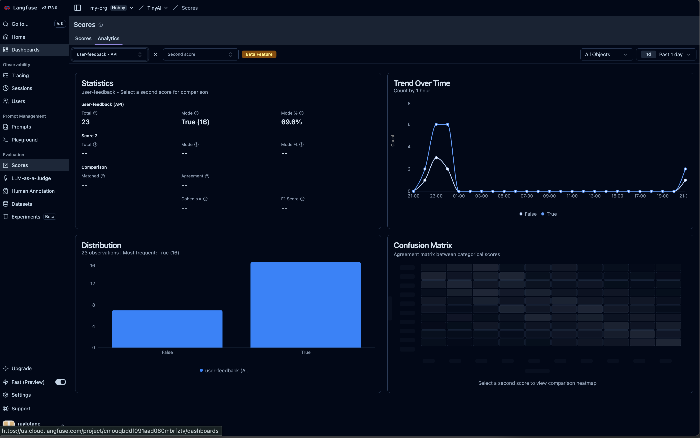
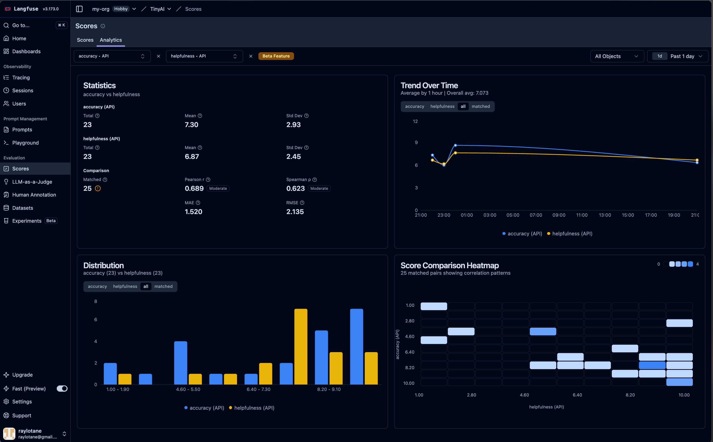

# v2 - 引入 RAG 与评估体系：让 AI 回答有据可依、有据可评

## 背景

v1 完成了 AI 对话的基础设施建设：链路通了、Prompt 托管了、多轮对话跑起来了。但当我们真正把 AI 交给用户时，会发现两个新问题：

1. **AI 会胡说八道**：模型只知道训练数据里的内容，不知道你的业务知识。怎么让它基于真实资料回答问题？
2. **AI 回答得好不好，怎么量化**：感觉"还行"不够，需要把回答质量变成可追踪的指标。

v2 针对这两个问题，引入两个核心能力：

- **RAG（检索增强生成）**：在回答前从知识库检索相关资料，让 AI 基于真实内容作答
- **评估体系**：从用户主观反馈 + AI 客观评分两个维度，量化每一次回答的质量

所有评估数据都会回传到 **Langfuse**，后续可以分析、对比、做模型迭代决策。

## 技术方案

```
User Input → Fuse.js 模糊搜索 → 知识库匹配
                    ↓
         拼接上下文 + 用户问题
                    ↓
     ai-sdk → DeepSeek API → Response
                    ↓
     ┌──── 评估管线（两条）────┐
     ↓                        ↓
 用户反馈                    AI Judge
 (赞/踩)                 (3维度自动评分)
     ↓                        ↓
   Langfuse Score (BOOLEAN)  Langfuse Score (NUMERIC)
```

**选型新增：**
- 知识库检索：`fuse.js`（轻量级模糊搜索，无需额外服务）
- 评估模型：复用 `deepseek-v4-flash`（不需要单独部署裁判模型）

## 核心代码

### 1. 知识库构建

**rag/article.ts**

```typescript
const doc1 = `**标题**：🥤NOWWA挪瓦咖啡｜此时此刻，来一杯"刚刚好"的能量

**正文**：
咖啡是什么？
有人说是早上的清醒剂，有人说是下午的小逃离。
但对我们来说，咖啡就是——此时此刻，你想喝的那一口。

✨ NOWWA挪瓦咖啡
- 「NOW」= 现在
- 「WA」= 等一下，也可以是"哇"的惊喜
合起来就是：现在就行动，等一下就有好咖啡。
......`

// 共 5 篇咖啡品牌相关文档
export const docs = [doc1, doc2, doc3, doc4, doc5]
```

知识库就是一组 Markdown 文档集合。这里以 NOWWA 咖啡为例，包含品牌介绍、产品推荐、生活场景等内容。在实际业务中，这里可以是产品文档、FAQ、技术手册等。

### 2. Fuse.js 模糊搜索

**rag/search.ts**

```typescript
import Fuse from "fuse.js";
import { docs } from "./article";

const fuse = new Fuse(docs, {
  includeScore: true,
  threshold: 1,     // 0=精确匹配，1=完全模糊
});

export const fuseSearch = (query: string) => {
  return fuse.search(query);
};
```

`threshold: 1` 表示不做严格关键词匹配，让 Fuse 做全模糊搜索——用户用口语化的描述也能命中相关内容。

### 3. 检索 + 上下文注入

**index.ts**（RAG 核心逻辑）

```typescript
import { fuseSearch } from './rag/search';

/** 从知识库检索相关内容，格式化为 AI 上下文 */
function buildSearchContext(query: string): string {
  const results = fuseSearch(query);
  if (results.length === 0) return '';

  return results
    .slice(0, 3)
    .map((r, i) => `[参考资料 ${i + 1}]（相关度: ${(1 - (r.score ?? 0)).toFixed(2)}）
${r.item}`)
    .join('\n\n---\n\n');
}

async function chat() {
  // ...

  // 检索相关知识
  const context = buildSearchContext(prompt);

  // 构建带上下文的用户消息
  const userContent = context
    ? `请基于以下参考资料回答问题：\n\n${context}\n\n---\n\n问题：${prompt}`
    : prompt;

  // 生成回答...
}
```

每次用户提问时，先通过 `fuseSearch` 从知识库检索最相关的 3 条资料，拼接成带相关度的上下文注入到 prompt 中。如果知识库中没有相关内容，则退化为普通对话（fallback 策略）。

### 4. 用户反馈（主观评估）

**scoring.ts** — `collectUserFeedback`

```typescript
import { trace } from '@opentelemetry/api';
import { LangfuseClient } from "@langfuse/client";

const tracer = trace.getTracer('rag');
const langfuse = new LangfuseClient();

/** 收集用户对 AI 回答的反馈（赞/踩）*/
export async function collectUserFeedback(messageId: string) {
  const { feedback } = await inquirer.prompt([
    {
      type: 'select',
      name: 'feedback',
      message: '👆 对本次回答满意吗？',
      choices: [
        { name: '👍 满意', value: 'thumbs_up' },
        { name: '👎 不满意', value: 'thumbs_down' },
      ],
    },
  ]);

  if (feedback === 'skip') return null;

  tracer.startActiveSpan('user-feedback', async (span) => {
    await langfuse.score.create({
      traceId: messageId,
      name: 'user-feedback',
      value: feedback === 'thumbs_up' ? 1 : 0,
      dataType: 'BOOLEAN',
    });
    span.end();
  });
}
```

每次回答后，用户选择满意/不满意，结果以 `BOOLEAN` 类型写入 Langfuse Score。`traceId` 使用本轮 `messageId`，可以在 Dashboard 上精确定位到具体的问答环节。

### 5. AI Judge（自动评估）

**scoring.ts** — `runAiJudge`

```typescript
export async function runAiJudge(
  messageId: string,
  prompt: string,
  text: string,
  context: string,
  sessionId: string,
) {
  const judgeSystem = `你是 AI 回答质量评估员。请从以下三个维度对 AI 的回答进行评分，并给出总结。

评分标准（每项 1-10 分）：
- helpfulness：回答是否解决了用户问题，是否实用
- accuracy：回答是否准确，是否有事实错误
- relevance：回答是否与问题相关，是否紧扣主题

请严格返回 JSON 格式，不要包含其他内容：
{
  "helpfulness": <1-10>,
  "accuracy": <1-10>,
  "relevance": <1-10>,
  "summary": "<一句话总结>"
}`;

  const { text: evaluation } = await generateText({
    model: deepseek('deepseek-v4-flash'),
    system: judgeSystem,
    messages: [
      { role: 'user', content: `## 用户问题\n${prompt}\n\n## 参考资料\n${context || '无'}\n\n## AI 回答\n${text}` }
    ],
    experimental_telemetry: { isEnabled: true, functionId: 'ai-judge' },
  });

  const scores = JSON.parse(evaluation);

  await Promise.all([
    langfuse.score.create({ traceId: messageId, name: 'helpfulness', value: scores.helpfulness, dataType: 'NUMERIC' }),
    langfuse.score.create({ traceId: messageId, name: 'accuracy', value: scores.accuracy, dataType: 'NUMERIC' }),
    langfuse.score.create({ traceId: messageId, name: 'relevance', value: scores.relevance, dataType: 'NUMERIC' }),
    langfuse.score.create({ traceId: messageId, name: 'judge-summary', value: scores.summary, dataType: 'TEXT' }),
  ]);
}
```

用 DeepSeek 自己来当裁判（self-evaluation 模式），从三个维度打分：

| 维度 | 含义 | 记录类型 |
|------|------|---------|
| helpfulness | 是否解决了用户问题 | NUMERIC (1-10) |
| accuracy | 是否有事实错误 | NUMERIC (1-10) |
| relevance | 是否紧扣主题 | NUMERIC (1-10) |
| judge-summary | 一句话总结 | TEXT |

同一条 `messageId` 关联了用户消息、AI 回答、用户反馈、AI 评分四类数据——在 Langfuse 中形成一个完整的评估闭环。

### 6. v2 完整对话入口

**index.ts**（chat 函数整体流程）

```typescript
async function chat() {
  const { prompt } = await inquirer.prompt([...]);

  const messageId = crypto.randomUUID();

  // ① RAG 检索
  const context = buildSearchContext(prompt);

  // ② 拼接上下文
  const userContent = context
    ? `请基于以下参考资料回答问题：\n\n${context}\n\n---\n\n问题：${prompt}`
    : prompt;

  history.push({ role: 'user', content: userContent });

  // ③ AI 生成
  const { text } = await generateText({
    model: deepseek('deepseek-v4-flash'),
    messages: history,
    system: customerServicePrompt,
    experimental_telemetry: { isEnabled: true, metadata: { sessionId, messageId } },
  });

  history.push({ role: 'assistant', content: text });

  // ④ 评估管线
  await collectUserFeedback(messageId);   // 用户主观反馈
  await runAiJudge(messageId, prompt, text, context, sessionId);  // AI 自动评分

  chat();
}
```

## 启动方式

```bash
bun install
bun dev
```

无需额外启动外部服务（Fuse.js 是纯内存搜索，不需要数据库或向量引擎）。

## 运行效果

```
Session ID:ec8d18a7-0478-407e-af56-bb407ea6f35d
🎯 AI 对话助手 (输入 q 退出)

✔ 💬 你： 你是谁

⏳ 思考中...

🤖 AI： 你好呀！我是挪瓦（NOWWA）咖啡的智能助手Alice☕️。我可以帮你了解菜单、推荐饮品、查询门店信息或者解答任何关于挪瓦咖啡的问题。有什么可以帮你的吗？😊 

✔ 👆 对本次回答满意吗？ 👍 满意
✔ 💬 你： 适合晚上吗

⏳ 思考中...

🤖 AI： 当然适合！参考资料里专门提到了**瞬间6：熬夜赶方案**——如果你晚上需要加班或熬夜，来一杯热厚乳拿铁，能让胃暖暖的，给疲惫的夜晚加点温度。不过如果你想更好地入睡，也可以选择低咖啡因或不含咖啡因的饮品（比如热牛奶或热巧克力），店里也有其他选择哦～有什么具体需求吗？我帮你推荐一杯合适的🌙☕️ 

✔ 👆 对本次回答满意吗？ 👍 满意
✔ 💬 你： 什么价格

⏳ 思考中...

🤖 AI： 根据参考资料，虽然没有列出具体的价格数字，但文中提到“NOWWA的价格不用犹豫”和“轻负担·快能量”，暗示价格友好、亲民。如果想了解具体饮品的价格，建议直接查看挪瓦咖啡的官方小程序或门店菜单，不同饮品和杯型会有差异哦！有什么想喝的款式我可以先帮你参考一下~😊 

✔ 👆 对本次回答满意吗？ 👎 不满意
```

回答中可以看到，AI 基于知识库内容（产品文档）做了准确的回答，而不是泛泛而谈。

> 用户打分



> AI 打分



## Langfuse Dashboard 能看到什么

| 维度 | 内容 |
|------|------|
| **Traces** | 每次请求的完整链路，包含 RAG 检索内容、用户反馈、AI 评分 |
| **Scores** | 横轴对比每个 session 的 helpfulness/accuracy/relevance 趋势 |
| **User Feedback** | 区分 thumbs_up/thumbs_down，计算用户满意度 |
| **Session 聚合** | 同一 sessionId 下的多轮对话 + 评分曲线 |

在 Langfuse 的 Scores 页面，可以按 `helpfulness`、`accuracy`、`relevance` 三个维度排序，快速找出质量最低的回答，定位问题。

## v2 评估体系总览

```
                     ┌──────────────────────┐
                     │     AI 回答输出        │
                     └──────────┬───────────┘
                                │
                    ┌───────────┴───────────┐
                    │                       │
           ┌────────▼────────┐    ┌─────────▼────────┐
           │  用户反馈（主观） │    │ AI Judge（客观）   │
           │                  │    │                    │
           │  BOOLEAN 赞/踩   │    │ NUMERIC 1-10 × 3   │
           │                  │    │ TEXT 总结 × 1      │
           └────────┬────────┘    └─────────┬────────┘
                    │                       │
                    └───────────┬───────────┘
                                │
                    ┌───────────▼───────────┐
                    │   Langfuse Scores     │
                    │  可追踪、可分析、可对比 │
                    └───────────────────────┘
```

两个维度的评估相互补充：用户反馈代表真实的体验感受，AI Judge 提供多维度量化打分。两者结合比单一指标更可靠。

## 本章小结

v2 在 v1 的基础上做了两件核心的事：

1. **RAG 落地**：用 Fuse.js 实现轻量级知识库检索，每次回答前自动注入相关资料，无需搭建向量数据库就能获得 RAG 的效果
2. **评估闭环**：用户反馈（赞/踩） + AI Judge（三维度评分），所有数据回传到 Langfuse Scores，让回答质量变得可量化、可追踪

一个关键的设计决策：**用 `messageId` 代替 `traceId` 做评估关联**。Langfuse 的 Score 既可以挂载到 Trace 上，也可以通过 `messageId` 精确关联到具体的消息。这样同一个对话 session 中的每一轮问答，都有独立的评分记录，后续可以精确定位问题所在。

---

**下一步预告**：v3 将探索 **Prompt 评测与回归测试**——当 Prompt 迭代时，如何保证新旧版本的回退质量？敬请期待。

> 项目地址：https://github.com/raylotane/ai-evaluation-apply-in-langfuse
> 版本标签：[v2.0.0](https://github.com/raylotane/ai-evaluation-apply-in-langfuse/releases/tag/v2.0.0)
