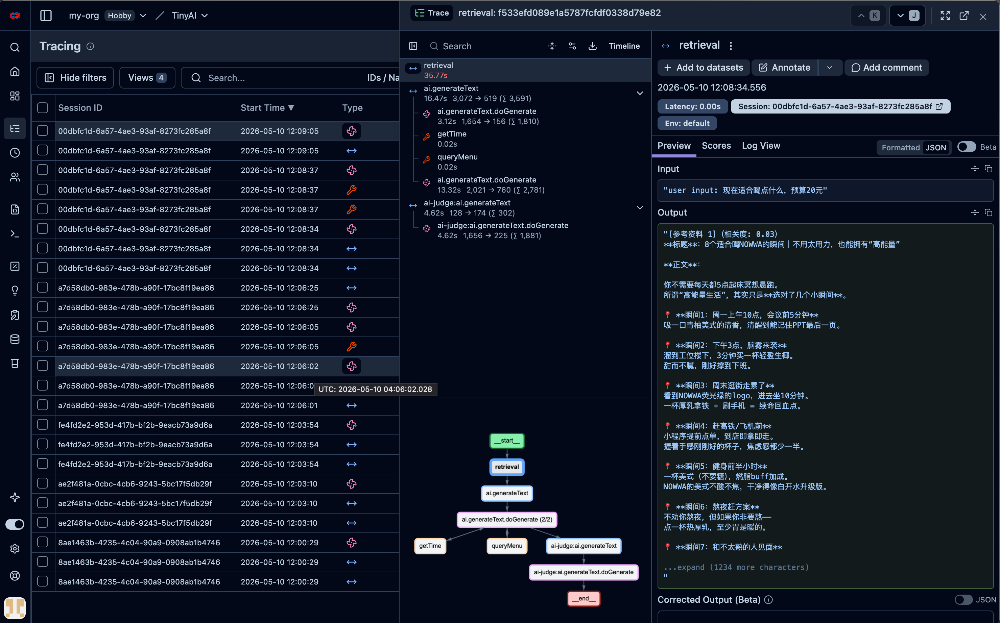

# v3 - 从 RAG 到 Agent：让 AI 学会"动手做事"

## 背景

v2 让 AI 具备了"查资料"的能力——每次回答前从知识库检索相关内容。但 AI 仍然是被动的：用户问什么，它答什么，无法主动执行操作。

实际业务场景中，用户的需求往往不是"回答一个问题"，而是**完成一个任务**：

- "晚上适合喝什么？" → 需要查菜单 + 看时间 → 推荐
- "现在天气怎么样？来杯冰的吧" → 查天气 + 查菜单 → 综合推荐
- "有什么性价比高的？" → 查菜单 + 比价 → 给出建议

这些场景需要 AI **主动决策**：理解用户意图 → 判断需要调用什么功能 → 执行调用 → 基于结果回答。

v3 的核心升级：**从 Chat 到 Agent**。

## 技术方案

```
User Input → RAG 检索（v2）
                    ↓
          ToolLoopAgent 接管
                    ↓
    ┌──── 自主决策：需要调用什么工具？────┐
    ↓               ↓               ↓
 查菜单          查天气           查时间
    ↓               ↓               ↓
    └────── 综合结果生成回答 ───────┘
                    ↓
          ┌─── 评估管线 ───┐
          ↓                ↓
      用户反馈          AI Judge
          ↓                ↓
       Langfuse（含完整 Trace）
```

**关键变化：**
- 架构：`generateText` → `ToolLoopAgent`（ai SDK 6.0）
- 工具系统：Zod schema 驱动的类型安全工具定义
- 可观测性：从手动 Telemetry → `@langfuse/tracing` 自动埋点
- RAG 检索本身也被纳入 Trace 追踪

## 核心代码

### 1. Agent 模式：用 ToolLoopAgent 替代 generateText

**index.ts**（v3 入口变化）

```typescript
import { ToolLoopAgent } from 'ai';
import { queryMenuTool, weatherTool, getTimeTool } from './tools/menu';

const agent = new ToolLoopAgent({
  model: deepseek('deepseek-v4-flash'),
  instructions: customerServicePrompt,
  tools: {
    queryMenu: queryMenuTool,
    weather: weatherTool,
    getTime: getTimeTool,
  },
  experimental_telemetry: { isEnabled: true },
  onFinish: async (result) => {
    updateActiveObservation({ output: result.content });
    trace.getActiveSpan()?.end();
  },
});
```

`ToolLoopAgent` 是 ai SDK 6.0 提供的 Agent 抽象。传入 tools 后，AI 会自动判断何时调用哪个工具，循环执行直到任务完成。`onFinish` 回调确保 Langfuse 追踪在流式输出完成后正确收尾。

### 2. 工具定义：类型安全的 Function Calling

**tools/menu.ts**

```typescript
import { tool } from 'ai';
import { z } from 'zod';

const menu: MenuItem[] = [
  { name: '冰美式', price: 18, category: '美式' },
  { name: '轻盈生椰拿铁', price: 25, category: '拿铁' },
  { name: '袋鼠特调', price: 30, category: '特调' },
  // ...
];

export const queryMenuTool = tool({
  description: '查询 NOWWA 咖啡菜单，返回咖啡名称和价钱。支持按类别筛选',
  inputSchema: z.object({
    category: z.string().optional(),
  }),
  execute: async ({ category }) => {
    if (!category) return menu;
    const filtered = menu.filter(item => item.category === category);
    return filtered.length > 0 ? filtered : `未找到类别「${category}」下的商品`;
  },
});

export const weatherTool = tool({
  description: '获取城市天气',
  inputSchema: z.object({
    city: z.string().describe('The city to get the weather for'),
  }),
  execute: async ({ city }) => ({
    city, temperature: 20, description: 'Sunny',
  }),
});

export const getTimeTool = tool({
  description: '获取当前日期和时间',
  inputSchema: z.object({}),
  execute: async () => {
    const now = new Date();
    return {
      datetime: now.toISOString(),
      formatted: now.toLocaleString('zh-CN', { timeZone: 'Asia/Shanghai' }),
      timezone: 'Asia/Shanghai',
    };
  },
});
```

三个工具覆盖了 NOWWA 咖啡助手的核心能力：查菜单、查天气、看时间。每个工具用 `zod` 定义入参 schema，ai SDK 自动做参数校验和类型推导。`description` 字段是关键——它告诉 AI **什么时候调用这个工具**。

### 3. Langfuse Tracing 升级：自动埋点

**index.ts**（Tracing 集成）

```typescript
import {
  observe,
  propagateAttributes,
  updateActiveObservation,
} from "@langfuse/tracing";

// 用 observe 包裹 chat 函数——自动追踪每次对话
const chatWithTrace = observe(chat, {
  name: "handle-chat-message",
  endOnExit: false,
});

// 在请求中传播 session 上下文
const { text } = await propagateAttributes(
  { sessionId },
  async () => {
    const result = await agent.generate({ messages: history });
    return result;
  }
);
```

v2 使用 `experimental_telemetry` 手动标记每个请求，v3 升级为 `@langfuse/tracing` 的声明式方案：

| 变化 | v2（手动） | v3（自动） |
|------|-----------|-----------|
| 追踪方式 | `experimental_telemetry.metadata` | `observe()` 装饰器 |
| 上下文传播 | 手动传参 | `propagateAttributes` |
| Span 管理 | 手动 start/end | `updateActiveObservation` 自动管理 |
| 粒度 | 单个 generateText 调用 | 整个 chat 函数 + 子流程 |

### 4. RAG 检索纳入 Trace

**rag/search.ts**

```typescript
export function retrievalWithTrace(query: string, results: string, sessionId: string) {
  return tracer.startActiveSpan('retrieval', {
    attributes: { 'gen_ai.operation.name': 'retrieval', 'session.id': sessionId },
  }, async (span) => {
    const startTime = Date.now();

    span.setAttribute('input', `user input: ${query}`);
    span.setAttribute('output', results);
    span.setAttribute('retrieval.count', results.length);
    span.setAttribute('retrieval.threshold', 1);
    span.setAttribute('duration_ms', Date.now() - startTime);

    span.end();
    return results;
  });
}
```

v2 的 RAG 检索是一个黑盒——只知道它被调用了，不知道检索了什么、花了多久。v3 把检索过程也变成可观测的 span，记录 query、匹配结果、耗时等关键指标。在 Langfuse Trace 视图中，可以清楚看到每个请求的**检索阶段 → 工具调用阶段 → 生成阶段**。

### 5. UX 改进：加载动效

```typescript
const spinner = ora('🤔 思考中...').start();

const { text } = await agent.generate({ messages: history });

spinner.succeed(`🤖 AI：${text}`);
```

v2 用 `console.log('⏳ 思考中...')`，v3 换成 `ora` 加载动画。AI 思考时显示旋转动画，生成完成后替换为勾选 + 回答内容，体验更流畅。

### 6. v3 完整流程图

```
chatWithTrace()  ← observe 自动追踪
    │
    ├─ inquirer 获取用户输入
    │
    ├─ buildSearchContext(prompt, sessionId)
    │     ├─ fuseSearch(query)
    │     ├─ formatRetrievalContext(results)   → 格式化上下文
    │     └─ retrievalWithTrace()              → OpenTelemetry span
    │
    ├─ propagateAttributes({ sessionId })
    │     └─ agent.generate({ tools, messages })
    │           ├─ ToolLoopAgent 自主决策
    │           │    ├─ → queryMenu? → 查菜单
    │           │    ├─ → weather?   → 查天气
    │           │    ├─ → getTime?   → 看时间
    │           │    └─ → 无需工具   → 直接回答
    │           └─ onFinish → updateActiveObservation
    │
    ├─ ora spinner.succeed(text)
    │
    ├─ collectUserFeedback(messageId)    ← 用户主观评分
    └─ runAiJudge(messageId, ...)        ← AI 自动评分
```

## 启动方式

```bash
bun install
bun dev
```

和 v2 一样零外部依赖启动。Fuse.js 在内存中运行，工具调用由 ai SDK 自动路由。

## 运行效果

```
Session ID:00dbfc1d-6a57-4ae3-93af-8273fc285a8f
🎯 AI 对话助手 (输入 q 退出)

✔ 💬 你： 现在适合喝点什么，预算20元
✔ 🤖 AI：现在是 **中午12:08**，周日～刚吃完午饭的时间点，来杯清爽提神的正合适！☕

---

## ✅ 你的预算（20元）内可选饮品

| 饮品 | 价格 | 推荐理由 |
|:---|:---:|:---|
| 🥇 **冰美式** | **18元** ✅ | 清爽不酸不焦，午饭后来一杯超解腻 |
| 🥇 **醒醒美式** | **20元** ✅ | 刚好卡预算，名字就很适合中午提神醒脑 |

---

### 🌟 Alice 特别推荐：**冰美式（18元）**

理由如下👇

1. **时间段刚好**：中午12点刚过，来一杯冰美式消食提神，下午不犯困
2. **口味干净**：参考资料说 NOWWA 的美式「不酸不焦，干净得像白开水升级版」
3. **剩2元还能攒着** 👻 比预算省了2块，快乐加倍
4. **周日逛街/休息**：拿在手上边走边喝，清凉又自在

如果你觉得冰美式太"基础"，想多花2元换个感觉，**醒醒美式（20元）** 也是不错的选择，名字就自带"开工信号"🔋

---

**总结：花18元来杯冰美式，清爽解腻不超预算，周日下午的快乐就从这一杯开始～** 🧊☕✨

需要帮你看附近有没有 NOWWA 门店吗？😊 

✔ 👆 对本次回答满意吗？ 👍 满意
? 💬 你：
```

注意 AI 在回答前自动调用了 `getTime`（确认当前是晚上）和 `queryMenu`（查询菜单），然后综合两个信息给出推荐。这就是 Agent 模式的核心优势：**自主决策、主动执行**。

> 一次完整的执行流程追踪记录信息



## Langfuse Dashboard 能看到什么

| 维度 | v2 | v3 |
|------|----|----|
| **Traces** | 请求链路，含 RAG 内容 | 新增 **Tool Calling** 子 span |
| **工具调用** | 不展示 | 每次工具调用 + 参数 + 返回值 |
| **RAG 追踪** | 不展示 | 检索 query + 耗时 + 匹配数 |
| **Scores** | 用户反馈 + AI 评分 | 同上，不变 |
| **Session 聚合** | 多轮评分曲线 | 同上，附带工具调用详情 |

在 Langfuse Trace 页面中，v3 的每个请求会展开为：

```
handle-chat-message (chat 主流程)
 ├─ retrieval (RAG 检索 span)
 ├─ chat-response (agent.generate span)
 │    ├─ tool: queryMenu (工具调用 span)
 │    └─ tool: getTime (工具调用 span)
 ├─ user-feedback (用户反馈 span)
 └─ ai-judge (AI 评分 span)
```

每个 span 都记录了输入、输出、耗时——一次完整的**可观测 AI 决策链路**。

## v3 总览

```
v2 Chat 模式                      v3 Agent 模式
┌───────────────┐                ┌───────────────┐
│  用户输入      │                │  用户输入      │
└───────┬───────┘                └───────┬───────┘
        │                                │
┌───────▼───────┐                ┌───────▼───────┐
│  RAG 检索      │                │  RAG 检索      │
└───────┬───────┘                └───────┬───────┘
        │                                │
┌───────▼───────┐                ┌───────▼───────┐
│  generateText │                │ ToolLoopAgent  │
│  （被动回答）  │                │  （自主决策）   │
└───────┬───────┘                └───────┬───────┘
        │                         ┌───────┴───────┐
        │                         │  queryMenu    │
        │                         │  weather      │
        │                         │  getTime      │
        │                         └───────┬───────┘
        │                                │
┌───────▼───────┐                ┌───────▼───────┐
│  评估管线      │                │  评估管线      │
│  + Langfuse   │                │  + Langfuse    │
│               │                │  + 完整 Trace  │
└───────────────┘                └───────────────┘
```

## 本章小结

v3 在 v2 的 RAG + 评估体系基础上，完成了两个关键升级：

1. **Agent 架构**：从 `generateText` 迁移到 `ToolLoopAgent`，AI 从"被动回答"进化为"主动决策"。它能理解用户意图、自主选择工具、基于执行结果生成回答

2. **可观测性升级**：引入 `@langfuse/tracing`，用 `observe` / `propagateAttributes` 实现声明式追踪。RAG 检索、工具调用、模型生成各阶段都有独立的可观测 span，形成完整的 AI 决策链路

一个核心设计决策：**持续用同一套评估体系**。v2 的用户反馈 + AI Judge 方案在 v3 中保持不变，确保从 Chat 到 Agent 的能力升级不会导致评估体系的断裂。同一个 `messageId` 关联的评估数据，在 v2 和 v3 之间可以直接对比。

---

**下一步预告**：v4 将探索 **Prompt 评测与回归测试**——当 Prompt 迭代时，如何保证新旧版本的回退质量？如何自动化地验证工具调用的正确性？敬请期待。

> 项目地址：https://github.com/raylotane/ai-evaluation-apply-in-langfuse
> 版本标签：[v3.0.0](https://github.com/raylotane/ai-evaluation-apply-in-langfuse/releases/tag/v3.0.0)
